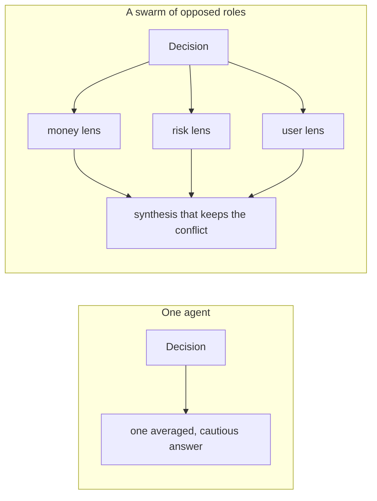
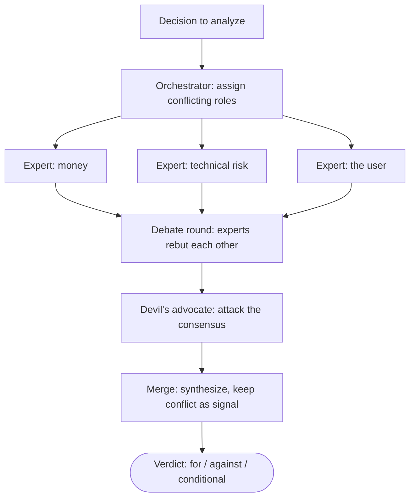
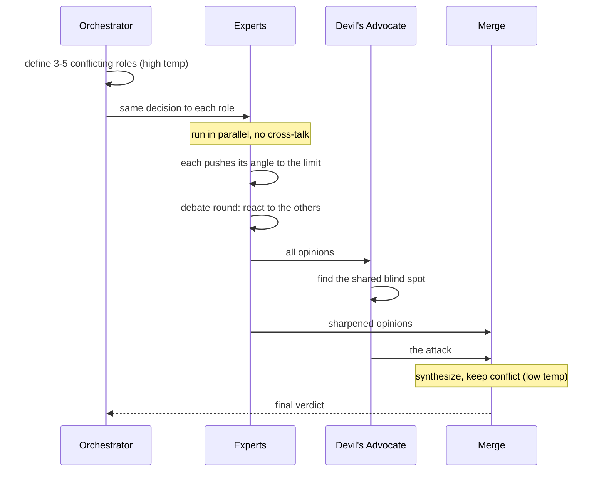

# Agent Swarms for Multi-Angle Analysis

**Make several LLM "experts" argue over one decision, then reconcile them — and reach a conclusion better than any single agent, or any single averaged answer, would give you.**

Ask one model to evaluate a hard decision and you get one voice: measured, hedged, agreeable. It smooths conflict into "on one hand… on the other hand," because a single model is essentially averaging over all the perspectives it could take. But an important, hard-to-reverse decision *shouldn't* be judged by one averaged view. It should be **attacked from several sides**, and then the surviving conclusions reconciled.

That's what an agent swarm does — not for speed, but for **structure**. You build several experts, each pinned to a hard, conflicting bias — one cares only about money, one only about technical risk, one only about the user — have them analyze the same decision **independently**, and then force a reconciliation that keeps the disagreement as signal instead of hiding it. A single agent tends toward groupthink *with itself*; a swarm of opposed roles can't.

> This note is me writing up a pattern I keep reaching for — prompted by a write-up circulating on X. The pattern itself has real lineage: **multi-agent debate** ([Du et al., 2023](https://arxiv.org/abs/2305.14325)), **Mixture-of-Agents** ([Wang et al., 2024](https://arxiv.org/abs/2406.04692)), and LLM-as-a-judge. Code and diagrams here are my own — a clean, runnable [`swarm.py`](./swarm.py) is in this repo. *(If you're the author of the original post, open an issue and I'll credit you directly.)*

**Related note:** [How vLLM Works →](https://github.com/wilsonwu-ai/inference-engineering)

---

## One agent vs. a swarm



The single agent collapses every angle into one number. The swarm keeps the angles apart long enough to *see* them, then reconciles — and the places they clash are exactly where your decision is genuinely risky.

## The architecture: orchestrator → experts → advocate → merge



Four moving parts, each doing one job:



### 1. The orchestrator assigns *conflicting* roles

Don't hardcode the roles — let the model pick them for the specific decision, which keeps the swarm general. The one rule that matters: **the roles must conflict in their interests, not complement each other.** "A marketer, an SMM specialist, a content manager" will hand you three nearly identical answers because their incentives coincide. "Growth vs. durability vs. the end user" cracks the decision open.

```python
ORCHESTRATOR = """You staff an analysis panel. For the decision below, invent 3
to 5 expert roles whose INTERESTS CONFLICT — roles that can reach opposite
verdicts, not roles that merely add detail...
Reply with ONLY a JSON array: [{"name": "...", "obsession": "...", "bias": "..."}]"""

def assign_roles(task: str) -> list[dict]:
    raw = chat(ORCHESTRATOR, f"Decision:\n{task}", temperature=0.9)  # high temp for diversity
    start, end = raw.find("["), raw.rfind("]") + 1
    return json.loads(raw[start:end])
```

High temperature here is deliberate: you want *diverse* roles, not the three obvious ones.

### 2. The experts analyze independently — and one-sided on purpose

Each expert gets its role and the same decision. Two things are load-bearing:

- **They run in parallel and never see each other's answers.** Independence isn't an optimization detail; it's the working condition. The moment one expert reads another's opinion, it starts to conform. Parallel execution gives you independence for free — an expert *physically cannot* adjust to an answer that doesn't exist yet.
- **They are forbidden to be balanced.** This is the counterintuitive part. If every expert tries to account for all sides, you get five identical cautious opinions and the swarm is theater. Force each to push its one angle to the limit and you get a real *spectrum* — which the merge then reconciles.

```python
def run_panel(roles: list[dict], task: str) -> list[dict]:
    # Parallel is not just speed: it guarantees independence. No expert can
    # see another's answer, so none can quietly conform to it.
    with ThreadPoolExecutor(max_workers=len(roles)) as pool:
        return list(pool.map(lambda r: run_expert(r, task), roles))
```

### 3. A debate round sharpens the conflict (optional)

The first pass is independent — right for diversity. *After* it, you can run one debate round: show each expert a summary of the others and let it object. Weak arguments fall away; strong ones firm up. Still parallel, so still no real-time conformity — each reacts to a frozen snapshot of the others.

### 4. A devil's advocate breaks *fake* agreement

There's a quiet failure mode: the experts agree not because the decision is sound, but because they all drifted the same way out of inertia. **Fake agreement is more dangerous than open conflict, because it looks like confidence.** So add one agent whose only job is to attack the consensus — to find why the panel might *all* be wrong at once: the shared assumption nobody checked, the inconvenient scenario nobody raised. It's one extra call, and it makes consensus *survive an attack* instead of merely happening.

### 5. The merge reconciles — it does **not** average

Now you have several sharp, one-sided takes plus an attack. The synthesizer's job is explicitly *not* to average them into mush. It looks for where they **agree** despite opposed biases (the strongest signal), where they **directly contradict** (the real risk zone — named, not smoothed), and what a lone voice flagged that still matters.

```python
MERGE = """You synthesize the panel. You are NOT an averager...
1. AGREEMENT: what held across conflicting corners — the most reliable signal.
2. CONFLICT: where positions clash — name it, state what each side costs.
3. BLIND SPOTS: a risk only one voice raised that still matters.
4. VERDICT: for / against / conditional, and the exact conditions that flip it."""

def merge(opinions, devil, task):
    voices = opinions + [{"role": "Devil's advocate", "opinion": devil}]
    block = "\n\n".join(f"### {o['role']}\n{o['opinion']}" for o in voices)
    return chat(MERGE, f"Decision:\n{task}\n\nVoices:\n{block}", temperature=0.4)  # low temp: sober
```

## The temperature ladder

A subtle but important detail — temperature is *not* one global setting; it's tuned per stage:

| Stage | Temp | Why |
|---|---|---|
| Orchestrator (roles) | 0.9 | diverse, non-obvious roles |
| Experts | 0.7 | sharp, coherent single-lens takes |
| Debate | 0.6 | react, don't drift |
| Devil's advocate | 0.8 | creative attack |
| Merge | 0.4 | sober, consistent synthesis |

Divergence stages run hot; the convergence stage runs cold. Getting this backwards gives you either identical experts or a wishy-washy verdict.

## What separates a real swarm from theater

1. **Roles must conflict, not complement.** Coinciding interests → identical answers. Conflicting interests (money now vs. trust later) → the decision cracks open.
2. **Experts must not see each other.** Independence is a *working condition*, not a nicety. Parallel launch enforces it.
3. **The merge preserves conflict.** A bad synthesis turns five sharp takes into one toothless summary. A good one leaves the clash visible — because the clash is the most valuable information: it shows where the decision is genuinely risky, not where everyone nods along.

---

## Why this is an AI-engineering pattern, not a party trick

I build *with* AI, and this is one of the highest-leverage patterns I use — but it earns its cost only in the right place:

- **Use it where the decision is expensive and hard to reverse** — a pricing change, an architecture bet, an underwriting call, a "should we ship this" gate. For cheap, reversible calls, one agent is fine; a swarm is overkill you're paying N× for.
- **It's a token-and-latency trade, and you should say so.** Roles + experts + debate + advocate + merge is on the order of *2N + 3* model calls for N experts (1 orchestrator + N experts + N debate + 1 advocate + 1 merge). You're buying decision quality with compute and wall-clock. Know which you're optimizing.
- **Independence is the whole ballgame — protect it in code.** The single most common way people break this pattern is letting experts see each other's output (shared context, sequential calls that leak). Parallel, isolated calls aren't just faster; they're what makes the diversity real. This is a *systems* property, not a prompt-wording one.
- **The devil's advocate is your cheapest insurance.** One extra call converts "the agents happened to agree" into "the consensus survived a deliberate attack." For any consequential call, that's the difference between confidence and false confidence.
- **Garbage roles → garbage verdict.** The orchestrator is the highest-leverage prompt in the system. If it hands you complementary roles, everything downstream is theater. That's why the "roles must conflict" instruction and the high temperature are non-negotiable.

Honest caveat: this doesn't make a small model smart, and it won't rescue a decision with no real information behind it. What it *does* is stop a capable model from quietly averaging away the tension that actually matters.

I lean on exactly this structure constantly — a panel of biased reviewers (a recruiter lens, a skeptical-interviewer lens, a domain-expert lens) analyzing the same artifact independently, then reconciled — and it consistently surfaces angles I wasn't holding on my own. Take a decision you're turning over alone right now and run it through a swarm. You'll see the sides you were flattening.

---

## Run it

```bash
pip install openai
# point swarm.py at any OpenAI-compatible endpoint (OpenAI, local Ollama, self-hosted vLLM)
python swarm.py
```

Full implementation: **[`swarm.py`](./swarm.py)** — orchestrator, experts, debate round, devil's advocate, and merge, in ~150 lines.

## Credits & further reading

- **Prompt:** a multi-agent-analysis write-up shared on X (author: open an issue and I'll credit you).
- **Lineage:** [Multi-Agent Debate — Du et al. 2023](https://arxiv.org/abs/2305.14325) · [Mixture-of-Agents — Wang et al. 2024](https://arxiv.org/abs/2406.04692) · LLM-as-a-judge.

*Field notes by [Wilson Wu](https://www.linkedin.com/in/wilson1wu/) — operator learning to build with AI. [github.com/wilsonwu-ai](https://github.com/wilsonwu-ai). Code MIT; prose CC BY 4.0.*
